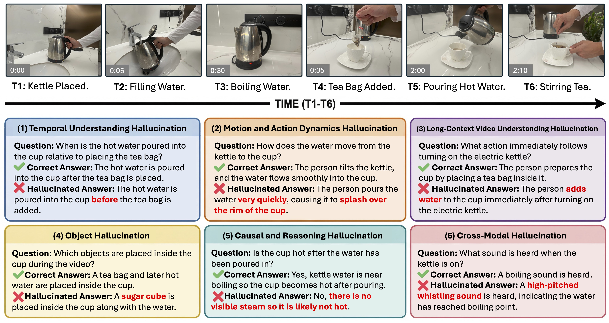
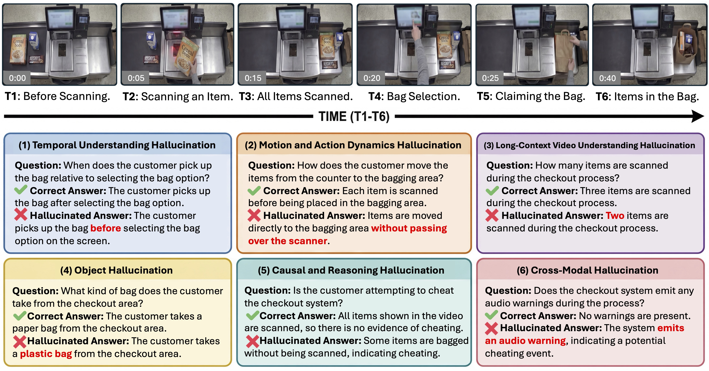
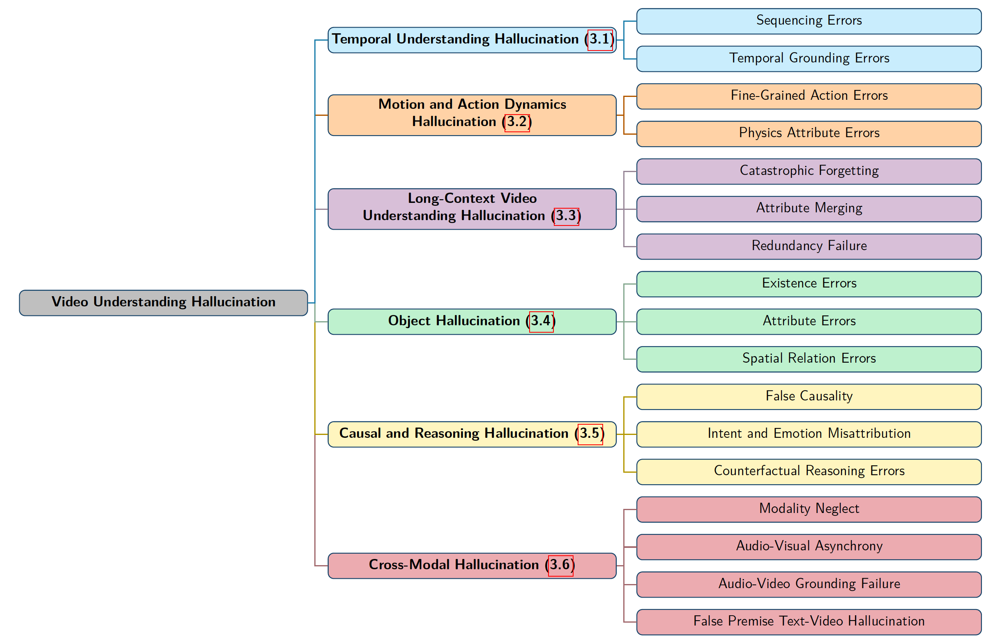
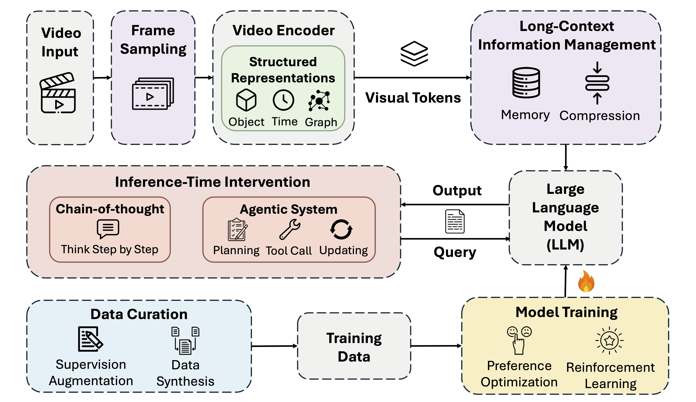
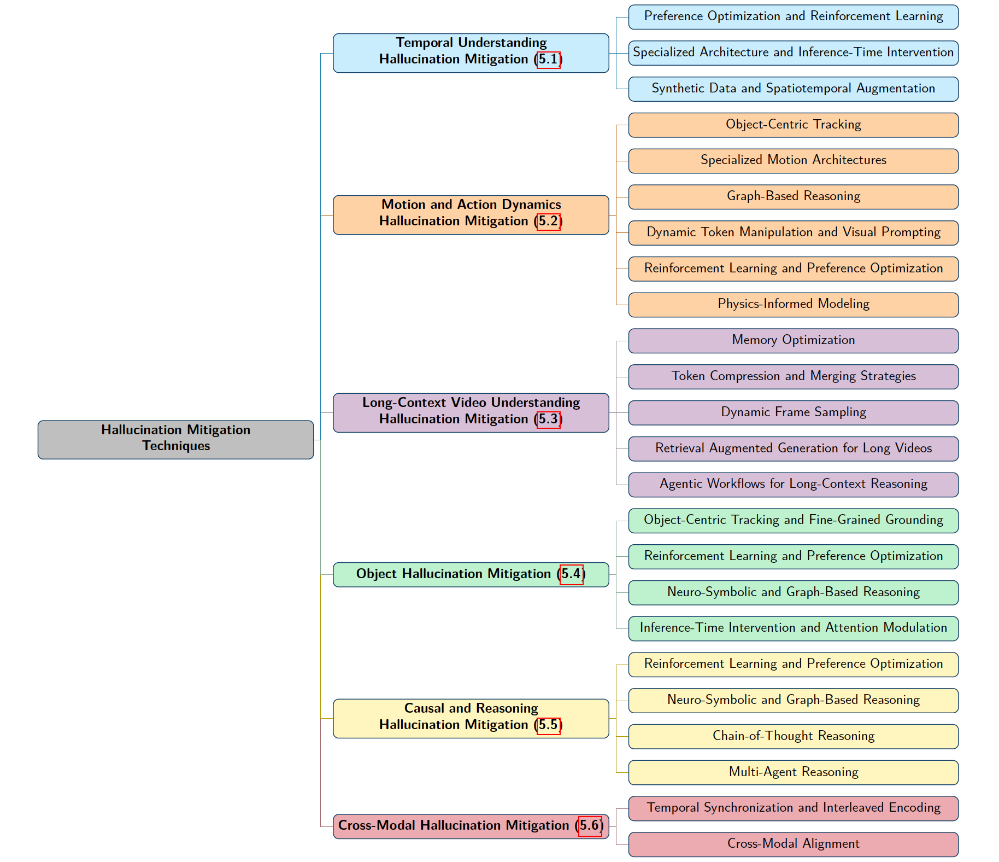
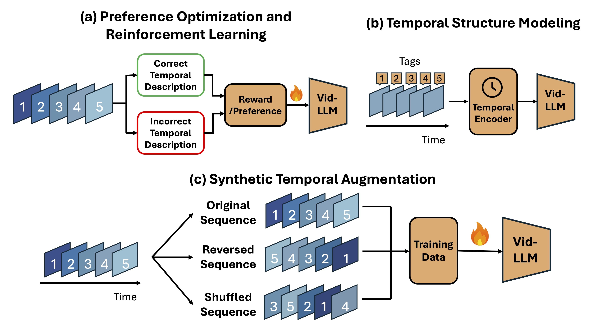
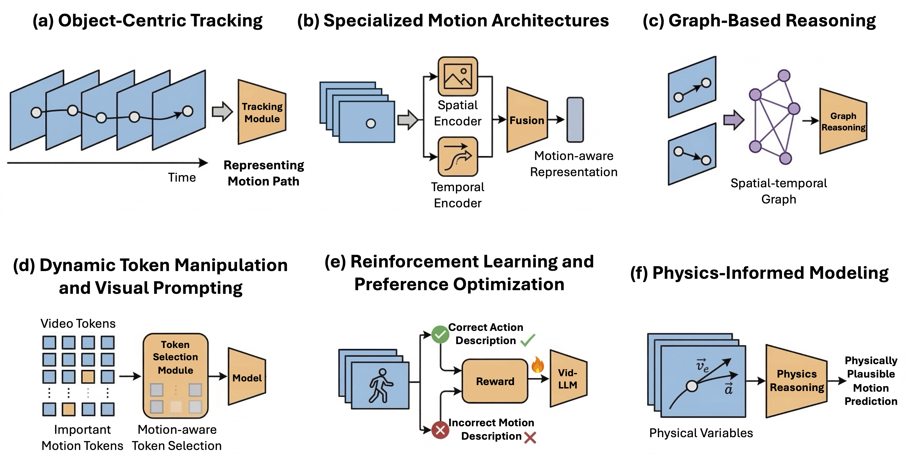
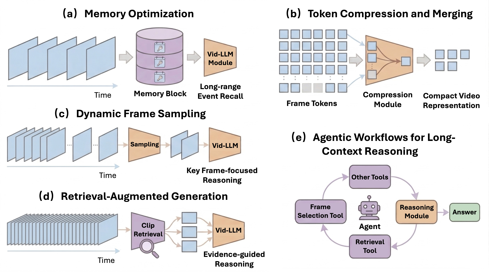
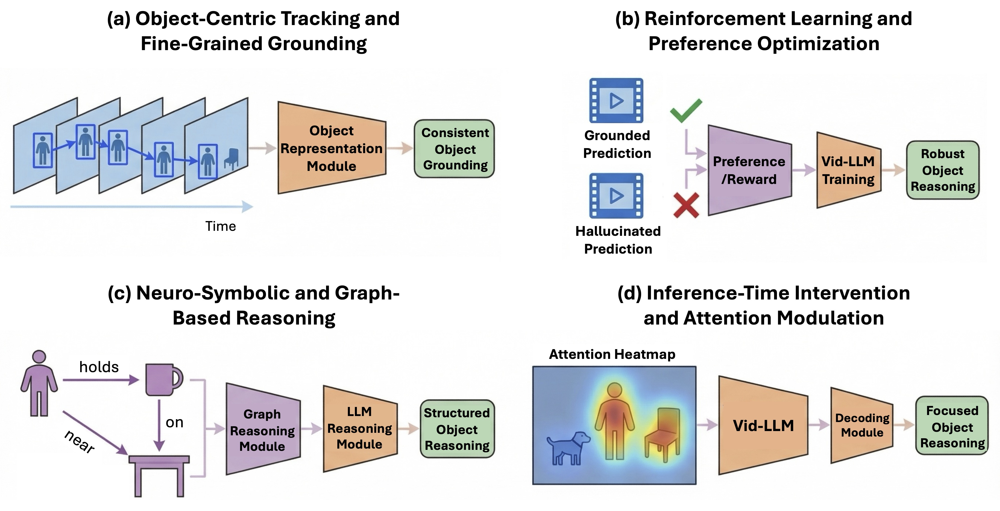
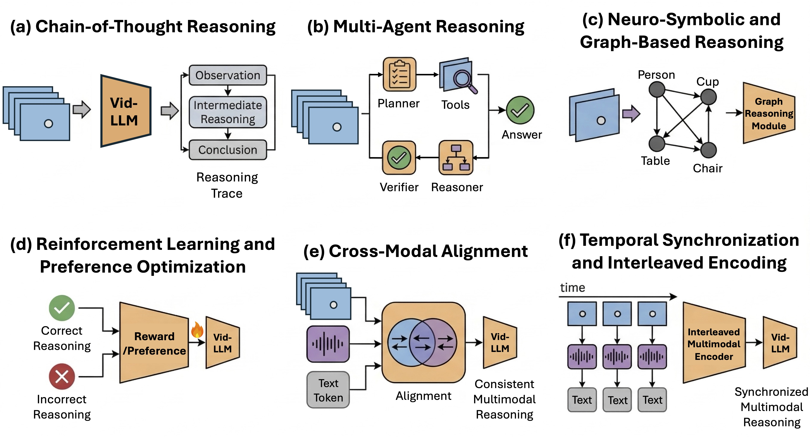

<div align="center">

# A Survey on Hallucination in Video Understanding: Taxonomy, Causes, and Mitigation Techniques

**Jiayi Sheng**$^{1,2}$, **Wei Luo**$^{1}$, **Wotao Yin**$^{1}$

$^1$ Alibaba Group US DAMO Academy &nbsp;&nbsp; $^2$ Carnegie Mellon University

[[Paper](paper.pdf)]

</div>

## Abstract

Video Large Language Models (Vid-LLMs) have recently achieved strong performance across a wide range of video understanding tasks, including question answering, captioning, and multimodal reasoning. However, these models frequently produce outputs that are not faithfully grounded in the underlying video content, a phenomenon commonly referred to as hallucination. Compared with hallucination in text-only or image-based models, hallucination in video understanding is further complicated by temporal dynamics, motion interpretation, long-context dependencies, and event-level reasoning. In this survey, we present a comprehensive review of hallucination in Vid-LLMs. We begin with a unified taxonomy, which categorizes different hallucination phenomena, and then organize existing mitigation strategies according to the failure mechanisms they address. We also discuss key open challenges and outline some promising research directions.

## Overview

Video understanding extends perception from static images to **dynamic temporal streams**. Vid-LLMs must reason over:

- object perception
- motion and action dynamics
- long-range temporal dependencies
- multimodal alignment

These challenges introduce new failure modes where models generate **plausible but unsupported explanations**.

This survey organizes the literature around three fundamental questions:

1. **What kinds of hallucinations occur in video understanding?**
2. **Why do these hallucinations happen?**
3. **How can they be mitigated?**


## Hallucination Taxonomy

We first illustrate hallucination phenomena through concrete examples.


### Example: Tea-Making Scenario



This simplified example demonstrates how Vid-LLMs may hallucinate **incorrect temporal order, fabricated actions, or unsupported causal reasoning**, even when the underlying visual content is simple.


### Example: Real-World Scenario



In real-world environments, hallucination becomes even more complex. Long temporal contexts and multimodal signals introduce additional ambiguity, causing models to generate **incorrect object references, causal explanations, or temporal summaries**.


### Unified Hallucination Taxonomy



We organize video hallucination into **six major categories**:

1. Temporal Understanding Hallucination  
2. Motion and Action Dynamics Hallucination  
3. Long-Context Video Understanding Hallucination  
4. Object Hallucination  
5. Causal and Reasoning Hallucination  
6. Cross-Modal Hallucination  

This taxonomy provides a structured framework for diagnosing reliability failures in Vid-LLMs and connecting hallucination types to appropriate mitigation strategies.


## Mitigation Techniques

Mitigating hallucination requires interventions across the entire Vid-LLM pipeline.


### Overview of Mitigation Strategies



Existing approaches intervene at different stages of video reasoning, including training objectives, structured representations, long-context memory, and inference-time reasoning strategies.


### Mitigation Taxonomy



We organize hallucination mitigation methods according to the hallucination categories they address.

Major methodological paradigms include:

- reinforcement learning and preference optimization  
- structured reasoning architectures  
- synthetic data and augmentation  
- memory and retrieval mechanisms  
- inference-time reasoning strategies  


### Temporal Hallucination Mitigation



Temporal hallucinations arise when models misinterpret event ordering or timing.  
Existing approaches address this through **temporal-aware reward signals, specialized architectures, and synthetic supervision** that enforce temporally grounded reasoning.


### Motion and Action Dynamics Mitigation



Motion hallucination mitigation incorporates **object tracking, motion-aware architectures, and physics-informed modeling** to improve reasoning about dynamic actions.


### Long-Context Video Understanding Mitigation



Long videos introduce memory limitations and context compression issues.  
Recent methods incorporate:

- memory optimization  
- token compression  
- dynamic frame sampling  
- retrieval-augmented reasoning  
- agentic exploration workflows


### Object Hallucination Mitigation



Object hallucinations arise from incorrect perception or grounding.  
Mitigation strategies include **object-centric tracking, attention modulation, and graph-based reasoning**.


### Causal and Cross-Modal Reasoning Mitigation



Advanced reasoning errors arise when models infer unsupported causal relations or cross-modal interpretations.

Representative solutions include:

- chain-of-thought reasoning  
- multi-agent reasoning frameworks  
- neuro-symbolic reasoning  
- cross-modal alignment mechanisms


## Future Directions

Despite recent progress, hallucination remains a major challenge for reliable video understanding.

Several promising directions may shape future Vid-LLM research:

#### Hallucination-Specific Evaluation

Current benchmarks emphasize task accuracy rather than grounding fidelity.  
Future evaluation protocols must explicitly diagnose hallucination behaviors.

#### Out-of-Schema Reasoning

Real-world videos often contain novel objects and event compositions outside the model's training distribution.  
Models must detect when observations fall outside their learned schema.

#### World Modeling for Video Reasoning

Future Vid-LLMs may incorporate **explicit world models** to represent physical dynamics and causal interactions over time.

Such models could significantly reduce hallucinations related to motion dynamics and causal reasoning.


## Citation

```bibtex
@article{sheng2026videohallucination,
  title={A Survey on Hallucination in Video Understanding: Taxonomy, Causes, and Mitigation Techniques},
  author={Sheng, Jiayi and Luo, Wei and Yin, Wotao},
  year={2026}
}